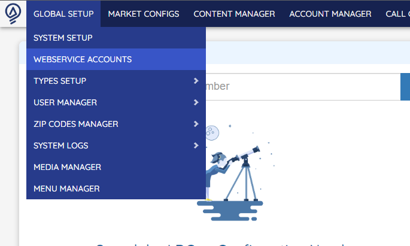

# OpsAdmin API Accounts

OpsAdmin provides an API to allow third party tools to request information from the system, and send data back to it. The technical documentation of the API, including processes and endpoints can be found [here](https://apidocs.ops-admin.com/).

The retail company has total control on the access rights to the API and configure the accounts by accessing WebService Accounts.

:::info
The API accounts are not connected to any other OpsAdmin account, meaning they don't give access to the administration site, Pricing Matrix, My Account, etc.
:::

When creating a new account, the system wil automatically generate to random keys that must be provided to the company that will connect with OpsAdmin: an API Key, and a Secret Key (also known as public and private keys). This authentication model provides extra security by allowing to log into the API by sending only part of the credentials. The usage of these are technical and described in the API documentation linked above.

Here it's possible to configure a name and description to identify the API user. Also it's possible to toggle the account to easily give or remove access to the API. The Use Refresh Token is optional an if enabled will require the API use to re-authenticate every few seconds.

The API has multiple usages and one of them is getting plans information from OpsAdmin. By assigning an affiliate to the account, the system will automatically filter and ONLY return the plans associated with the indicated affiliate.

Under the Access Rules section is possible to configure several options to increase the security or restrict the access to certain modules of the API. Roles work the same way as the OpsAdmin users roles, but in much more simplified way; there are few roles that can be assigned and each give access to few endpoints of the system. For example, Customer gives access to the My Account endpoints, while Plans And Rates give access to Plans and Enrollments endpoints. The special role here is Administrator which gives access to the whole API, ignoring any other configuration.

With Allowed IPs, it's possible to whitelist the desired IP addresses. If none is indicated, it's possible to use the API account from any IP; instead, if at least one IP is added, then the account will only be able to authenticate from that IP address meaning that every other IP address is blacklisted.

